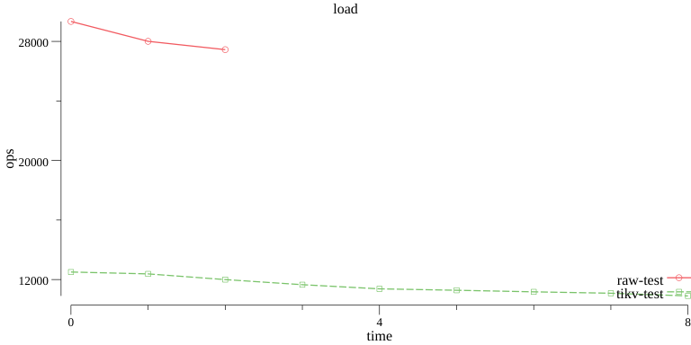
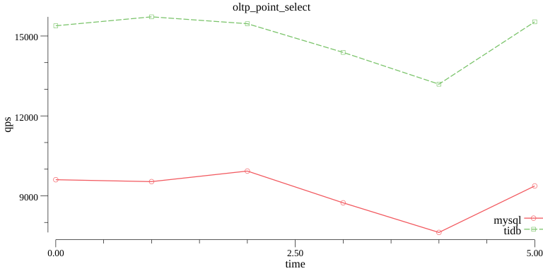

# Benchmark toolbox

## Reporter

The [`reporter`](./cmd/reporter) can help you generate some charts from the benchmark results. It can help you compare the performance of different databases, or check the performance changes of different versions for one database.





### Install

```bash
# Enter dbbench root directory

make 

# The reporter is installed in the dbbench/bin directory
```

### Support benchmark tool

+ [ycsb](https://github.com/pingcap/go-ycsb)
+ [sysbench](https://github.com/akopytov/sysbench)

### Usage

Please notice that you must use the same workload to do the benchmark, and save the benchmark result to a unique directory for later comparision. For example, if you want to compare the performance of TiKV 2.1 and 3.0 throught go-ycsb, you can use like below:

```bash
# Load data into TiKV 2.1 
OUTPUT=./2.1 dbbench/ycsb/bench.sh load raw -p tikv.pd=pd_2.1

# Load data into TiKV 3.0
OUTPUT=./3.0 dbbench/ycsb/bench.sh load raw -p tikv.pd=pd_3.0

# You must use different directories for benchmarking the same database, the reporter will use 
# `raw-3.0` and `raw-2.1` (the name format is db-parentDir) to distinguish the results in the output charts. 
reporter ycsb -p 2.1 -p 3.0 -o var 
```

If you want to compare different databases, you can save all data in one directory, e.g:

```bash
# Benchmark TiKV with Raw mode
dbbench/ycsb/bench.sh load raw
# Benchmark TiKV with TiKV mode
dbbench/ycsb/bench.sh load tivk

# Passing -i here to tell reporter to use db name only (no need to include the parent directory) as identification in the chart, 
reporter ycsb -p ./logs -o var -i
```

If you only want to care some workloads or some databases, you can do:

```bash
# Only care tikv and raw
reporter ycsb -p ./logs -o var -d tikv -d raw

# Only care load
reporter ycsb -p ./logs -o var -w load

# Only care raw and load
reporter ycsb -p ./logs -o var -d raw -w load
```

